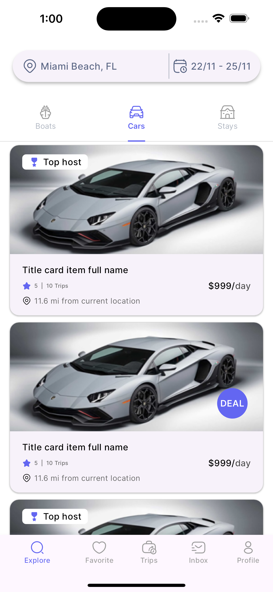
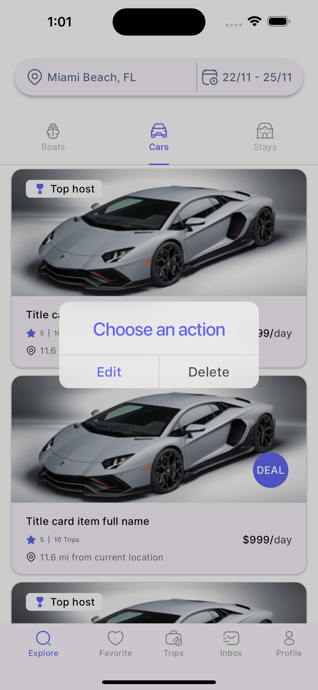
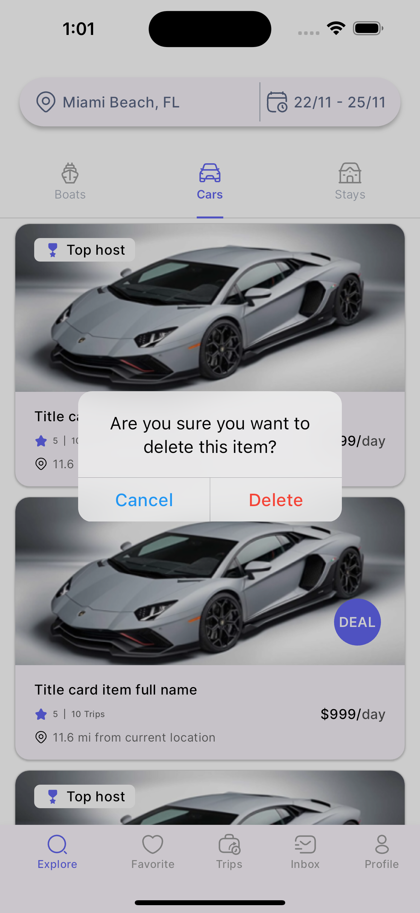
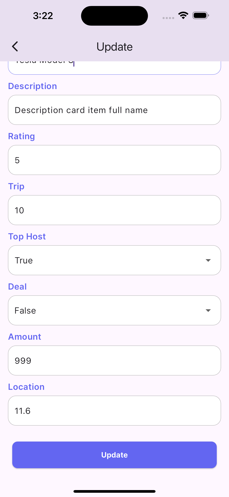

# Brokr App Assignment

This project is a simple Flutter application developed as part of a skills assessment of Brokr. It demonstrates the implementation of a cars tab and its listing screen using clean architecture and efficient state management practices. 

## Overview

The goal of this project is to showcase the development of a production-ready Flutter application. This application uses Riverpod for state management and adheres to clean architecture principles, simulating API calls with a fake data layer. 

## Features

- **Clean Architecture**: Implemented following the guidelines by Robert C. Martin to ensure scalable and maintainable code.
- **State Management with Riverpod**: Efficient state management solution for managing the app's state.
- **Simulated Data Layer**: Fake API calls using a Dart list of objects to simulate data interactions.
- **CRUD Operations**: Features include fetching, updating, and deleting car listings with a user-friendly interface.

## Screenshots

  
_Screenshot of the cars tab and listing screen_

  
_Screenshot of Dialog box which prompts the user for Edit and Delete Actions_

  
_Screenshot of Dialog box which prompts the user for Edit and Delete Actions_
  
_Screenshot of Dialog box which prompts the user for Edit and Delete Actions_

## Architecture

The project is structured following clean architecture principles, ensuring separation of concerns and making it easier to test and maintain. The architecture is divided into the following layers:

- **Presentation Layer**: UI components and state management using Riverpod.
- **Domain Layer**: Business logic and use cases.
- **Data Layer**: Fake data repository simulating network calls.

## Installation

To run this project, ensure you have Flutter installed on your machine. Then follow these steps:

1. Clone the repository:
   ```bash
   git clone https://github.com/abirAbuAsim/brokr-app-assignment.git
   ```
2. Navigate to the project directory:
   ```bash
   cd brokr-app-assignment
   ```
3. Install dependencies:
   ```bash
   flutter pub get
   ```
4. Run the application:
   ```bash
   flutter run
   ```

## Usage

- **Fetch Cars**: The main screen displays a list of cars fetched from the fake data layer.
- **Update Car**: Long press on a car item to open a dialog and choose to update. A sheet will appear with pre-filled data for editing.
- **Delete Car**: Long press on a car item to open a dialog and choose to delete the car from the list.

## Development Process

This project was developed with a focus on creating production-ready code. Key considerations include:

- **Maintainability**: Code is organized and commented for ease of understanding and future enhancements.
- **Performance**: Efficient state management and UI updates ensure a smooth user experience.
- **Scalability**: The architecture is designed to accommodate new features and modules with minimal refactoring.

## Experience

I have extensive experience in developing production-ready applications using Flutter. My expertise includes:

- Building complex UIs with Flutter.
- Implementing state management solutions like Riverpod and Provider.
- Designing and implementing clean architecture for scalable apps.
- Integrating third-party APIs and handling asynchronous data fetching.

## Future Enhancements

- **Integration with a real API**: Replace the fake data layer with real API calls.
- **Enhanced UI/UX**: Implement additional features and improve user interactions.

## Conclusion

This project demonstrates my ability to deliver high-quality, production-ready Flutter applications. I am excited to bring my expertise in Flutter development to your team.

## Contact

For any questions or discussions, please feel free to contact me at [abir.sakif@gmail.com](mailto:abir.sakif@gmail.com).

---

Thank you for the opportunity to showcase my skills. I look forward to contributing to your team.
